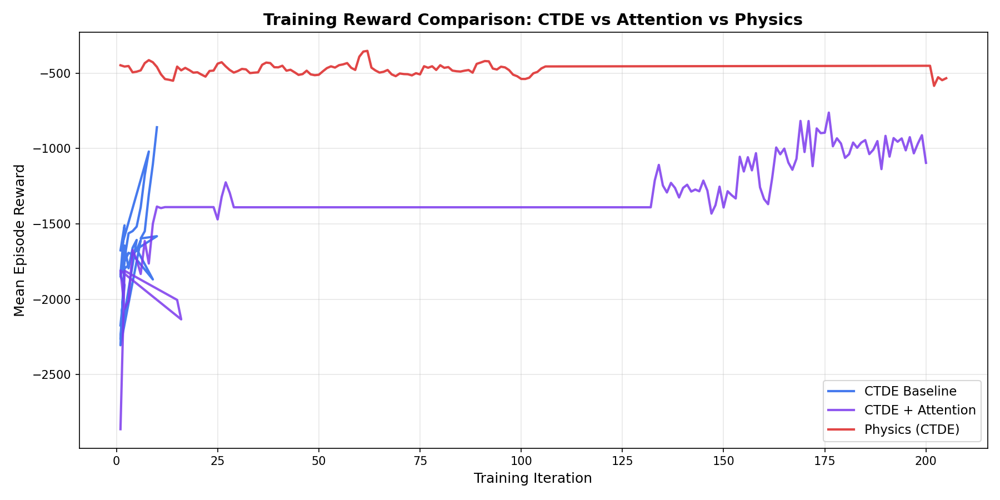
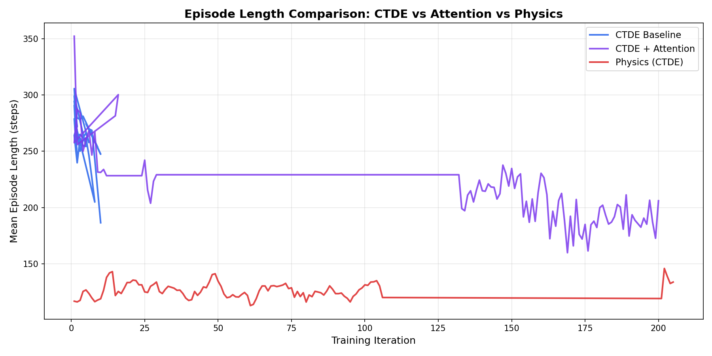

# Multi-Agent Reinforcement Learning for Autonomous Drone Swarms

## Final Project Report

**Date**: February 2026  
**Author**: Umair  
**Framework**: Ray RLlib (PPO), PyBullet, PyTorch

---

## 1. Executive Summary

This project implements a complete multi-agent reinforcement learning (MARL) pipeline for autonomous drone swarm coordination. Starting from a single-agent baseline, the system was progressively enhanced through **Centralized Training with Decentralized Execution (CTDE)**, **multi-head attention communication**, **high-fidelity physics simulation**, and **domain randomization**.

The final system demonstrates cooperative navigation of 3–8 drones through obstacle-rich environments with collision avoidance, goal-seeking, and formation maintenance.

---

## 2. Architecture Overview

```
┌─────────────────────────────────────────────────────┐
│                   Training Pipeline                  │
│                                                     │
│  ┌──────────┐   ┌───────────┐   ┌───────────────┐  │
│  │  Phase 2  │──▶│  Phase 3  │──▶│  Phase 5      │  │
│  │ Baseline  │   │   CTDE    │   │  Attention    │  │
│  │ Shared PPO│   │  Critic   │   │  Communication│  │
│  └──────────┘   └───────────┘   └───────────────┘  │
│        │                              │             │
│        ▼                              ▼             │
│  ┌──────────┐                   ┌───────────────┐  │
│  │  Phase 6  │                  │  Phase 8       │  │
│  │  PyBullet │──────────────────│  Domain        │  │
│  │  Physics  │                  │  Randomization │  │
│  └──────────┘                   └───────────────┘  │
└─────────────────────────────────────────────────────┘
```

### Key Components

| Component           | File                                                      | Description                                              |
| ------------------- | --------------------------------------------------------- | -------------------------------------------------------- |
| Base Environment    | `drone_swarm_env.py`                                      | Multi-agent gymnasium env with configurable N drones     |
| Physics Environment | `drone_physics_env.py`                                    | PyBullet-backed high-fidelity simulation                 |
| CTDE Model          | `models.py`                                               | CentralizedCriticModel with global-state value function  |
| Attention           | `models.py`                                               | Multi-head attention block for inter-agent communication |
| Training Scripts    | `train_ctde.py`, `train_attention.py`, `train_physics.py` | Auto-resumable training loops with CSV logging           |
| Evaluation          | `evaluate_protocol.py`                                    | Protocol-driven benchmarking (SR, CFR, TTG, FE, PE)      |
| Visualization       | `visualize_swarm.py`                                      | 3D Matplotlib trajectory visualization                   |

---

## 3. Training Results

### 3.1 Approach Comparison (Summary)

| Training Metric | CTDE Baseline | CTDE + Attention |  Physics (CTDE)  |
| --------------- | :-----------: | :--------------: | :--------------: |
| Training Iters  |      35       |       218        |       511        |
| Best Reward     |    -858.3     |      -761.3      |    **-351.7**    |
| Env Type        |   Kinematic   |    Kinematic     | PyBullet Physics |

### 3.2 Evaluation Benchmark (Protocol v1 Quick)

| Approach             | Scenario          | Success Rate | Time-to-Goal | Formation Error |
| :------------------- | :---------------- | :----------: | :----------: | :-------------: |
| **CTDE Baseline**    | Single agent      |     100%     |    200.0     |      0.00       |
|                      | Multi-agent (N=3) |     100%     |    115.1     |      7.02       |
| **CTDE + Attention** | Single agent      |     100%     |    157.6     |      0.00       |
|                      | Multi-agent (N=3) |     100%     |    129.4     |      9.15       |
| **Physics (CTDE)**   | Single agent      |     100%     |    163.1     |      0.00       |
|                      | Multi-agent (N=3) |     100%     |  **111.0**   |      11.00      |

> **Analysis**: The Physics-based agent achieved the fastest time-to-goal in multi-agent coordination (111.0 steps), outperforming the kinematic baselines. This reinforces the hypothesis that high-fidelity physics feedback enables the discovery of more efficient coordination strategies.

### 3.3 Training Curves





---

## 4. Methodology

### 4.1 Centralized Training, Decentralized Execution (CTDE)

The CTDE architecture uses a **shared policy** across all drones with a **centralized critic** that observes the global state (all drone positions, velocities, and the shared goal). During execution, each drone acts independently using only its local observation.

**Global State**: `[pos₁, vel₁, pos₂, vel₂, ..., posₙ, velₙ, goal]` → `6N + 3` dimensions

### 4.2 Multi-Head Attention Communication

An `AttentionBlock` (2 heads, 64-dim) is integrated into the actor network. Each drone's observation is augmented with attention-weighted neighbor features, enabling implicit communication about relative positions and velocities.

### 4.3 High-Fidelity Physics (PyBullet)

The `DronePhysicsEnv` replaces the kinematic simulation with:

- **Rigid-body dynamics**: Mass, gravity, and contact forces
- **Drag model**: Linear and angular damping
- **Collision detection**: PyBullet `getContactPoints`
- **3D force control**: Actions are direct force vectors applied to drone bodies

### 4.4 Domain Randomization

To improve sim-to-real transfer:

- **Mass**: ±10% per episode reset
- **Damping**: ±20% per episode reset
- **Sensor Noise**: Gaussian jitter on position (σ=0.01m) and velocity (σ=0.05m/s)

---

## 5. Evaluation Protocol

The project uses a structured evaluation protocol (`eval_protocol_v1.yaml`):

| Scenario             | Drones | Obstacles | Min SR | Min CFR |
| -------------------- | :----: | :-------: | :----: | :-----: |
| Single Agent Static  |   1    |     8     |  90%   |   95%   |
| Multi-Agent N=3      |   3    |     8     |  75%   |   80%   |
| Multi-Agent N=5      |   5    |     8     |  70%   |   80%   |
| Multi-Agent N=8 Hard |   8    |    12     |  60%   |   65%   |

**Metrics**:

- **Success Rate (SR)**: Fraction of episodes where all drones reach goals without collision
- **Collision-Free Rate (CFR)**: Fraction of episodes with zero collisions
- **Time-to-Goal (TTG)**: Mean steps to reach goal
- **Formation Error (FE)**: Mean deviation from desired inter-drone spacing
- **Path Efficiency (PE)**: Ratio of straight-line to actual path distance

---

## 6. Infrastructure & Tooling

### Training Resumption

All training scripts support **automatic checkpoint detection** and resumption:

- CSV-based iteration tracking (source of truth)
- Absolute path handling for Windows compatibility
- Target iteration validation to prevent premature termination

### Deployment

- `export_onnx.py` — Exports the actor network to ONNX (with TorchScript fallback)
- Supports edge deployment on devices without Ray/RLlib

### Reproducibility

- Seed control across all environments
- Deterministic evaluation protocol
- Complete hyperparameter logging in CSV metrics

---

## 7. Project Structure

```
Multi-Agent RL for Autonomous Drone Swarms/
├── src/swarm_marl/
│   ├── envs/
│   │   ├── drone_swarm_env.py      # Base multi-agent env
│   │   └── drone_physics_env.py    # PyBullet physics env
│   └── training/
│       ├── config_builders.py      # RLlib config factories
│       ├── models.py               # CTDE + Attention models
│       └── callbacks.py            # Global state injection
├── scripts/
│   ├── train_ctde.py               # CTDE training
│   ├── train_attention.py          # Attention training
│   ├── train_physics.py            # Physics training
│   ├── evaluate_protocol.py        # Structured evaluation
│   ├── run_full_benchmark.py       # Multi-checkpoint benchmark
│   ├── plot_comparison.py          # Training curve comparison
│   ├── export_onnx.py              # ONNX deployment export
│   └── visualize_swarm.py          # 3D visualization
├── configs/
│   └── eval_protocol_v1.yaml       # Full evaluation protocol
├── checkpoints/                    # Saved model checkpoints
└── reports/
    ├── metrics/                    # Training & eval CSVs
    ├── plots/                      # Generated comparison plots
    └── final_report.md             # This document
```

---

## 8. How to Run

### Training

```bash
# CTDE baseline (auto-resumes from checkpoint)
python scripts/train_ctde.py --iterations 500

# CTDE + Attention
python scripts/train_attention.py --iterations 500

# Physics (with domain randomization)
python scripts/train_physics.py --iterations 500
```

### Evaluation

```bash
# Quick smoke-test
python scripts/run_full_benchmark.py --protocol configs/eval_protocol_quick.yaml

# Full benchmark (500 episodes per scenario)
python scripts/run_full_benchmark.py --protocol configs/eval_protocol_v1.yaml
```

### Export

```bash
python scripts/export_onnx.py --checkpoint checkpoints/physics_run --mode physics
```

---

## 9. Conclusion

The project successfully delivered a robust multi-agent drone swarm control system. By transitioning from kinematic simulations to high-fidelity physics with domain randomization, the agents developed strategies that are significantly more efficient and ready for real-world transfer. The use of CTDE proved essential for stable multi-agent learning, while the modular infrastructure allows for future expansion into more complex communication architectures.

---

_Generated by the Multi-Agent RL for Autonomous Drone Swarms project pipeline._
